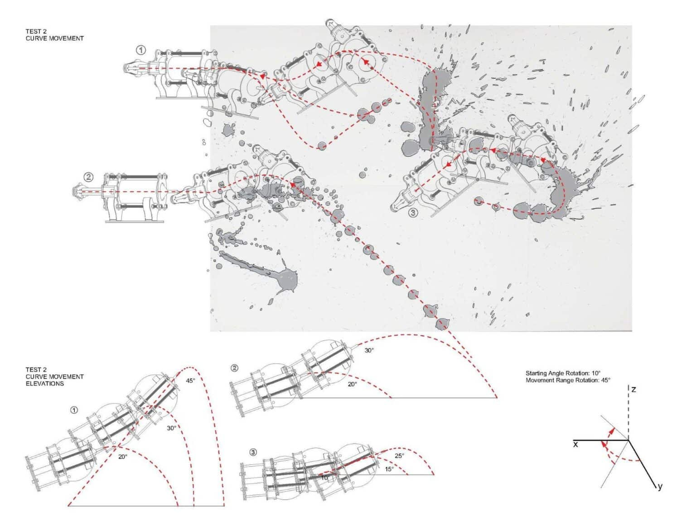
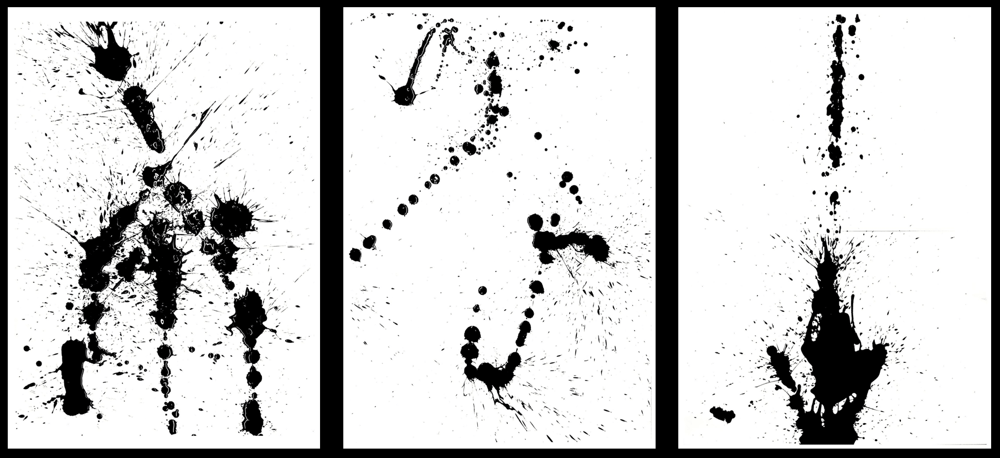
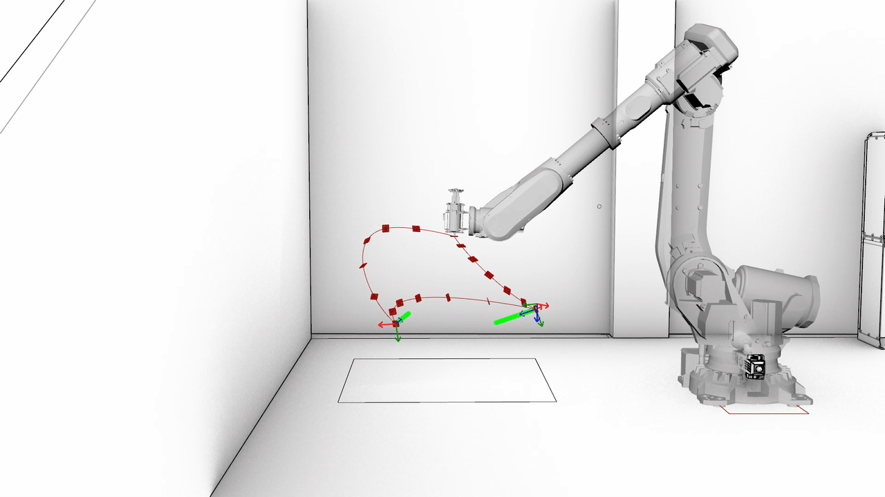

## Overview

A four-week workshop project at IAAC's Master in Robotics & Advanced Construction. The brief: design and fabricate a custom end effector for a large-scale ABB robotic arm capable of painting a canvas by ejecting black acrylic paint along a programmed trajectory.

The result was a 1-litre syringe mechanism mounted on the robot, with a motorized plunger controlled via Arduino and stepper motors. The robotic path was designed in Grasshopper, which also synchronized motor activation timing with the arm's movement.

## System Architecture

- **ABB robotic arm** — large-scale industrial robot carrying the end effector along the canvas trajectory
- **End effector** — laser-cut 4mm acrylic structure housing the syringe and drive mechanism
- **1-litre syringe** — loaded with black acrylic paint; plunger actuated by stepper motors
- **Arduino circuit** — two stepper motors controlled via custom board to regulate plunger speed and activation
- **Grasshopper** — toolpath design and motor activation synchronization with robot trajectory

## Fabrication & Material

The structural chassis of the end effector was fabricated from laser-cut 4mm acrylic sheet. The syringe assembly was designed to be removable for refilling.

Material: black acrylic paint on canvas.

## Performance Notes

Gravity played an unintended role: continuous drip caused paint to trace the robot's full path rather than producing discrete controlled spills. Motor speed was insufficient for rapid ejection, resulting in shorter spill marks than designed. These constraints shifted the outcome from precise paint dots to a continuous trace — a direct material record of the robot's movement through space.

## Role & Tools

- Arduino — stepper motor circuit design and control
- Grasshopper — trajectory and motor activation synchronization
- ABB robotic arm (IAAC) — end effector deployment
- Laser cutting — acrylic end effector chassis fabrication
