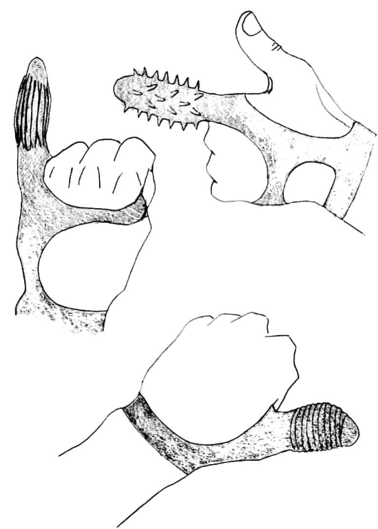
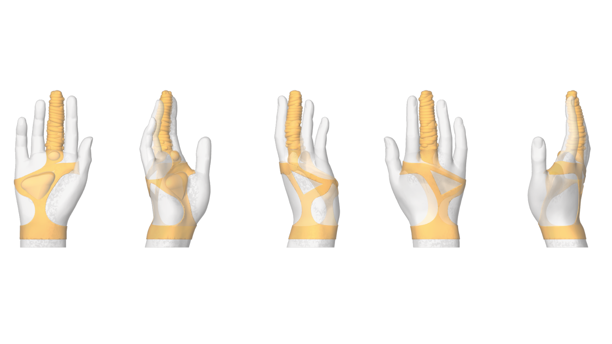
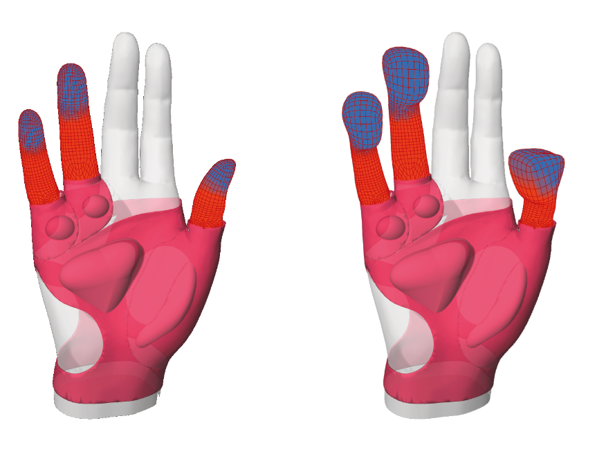

## Overview

Contacto was my undergraduate thesis, developed between 2019 and 2020. The project began as a  investigation into disability in Chile and its secondary effects on sexuality — a dimension of life rarely addressed in rehabilitation protocols or assistive technology design.

Through a qualitative  process involving in-depth interviews with people with spinal cord injuries, disability activists, Ministry of Health representatives, and rehabilitation professionals, the project identified a critical gap: the absence of tools designed to support sexual reintegration for people with psychomotor disabilities and genital sensory loss.

## The Device

The  led to the design of a **therapeutic glove** — a wearable device with internal chambers filled with therapeutic gel capable of maintaining and transitioning between different temperatures. The thermal variation enables the exploration of erogenous zones for users with reduced or absent tactile sensation, using temperature as a substitute sensory channel.

Key features:

- **Temperature control** — internal chambers using phase-change materials and gel compounds (similar in principle to reusable hand warmers) to generate and sustain controlled thermal gradients
- **Parametric textures** — the glove's outer surface could be customized with different textures, designed and edited through a **ShapeDiver** web interface, making each variant buildable without requiring CAD expertise
- **Soft robotics influence** — the design drew directly from soft robot technology: pneumatic actuators, compliant material structures, and body-conforming geometries informed both the glove's architecture and its thermal actuation logic
- **Material ** — prototypes were developed using therapeutic gel, Ecoflex silicone, and other compliant materials to evaluate tactile and thermal performance

## Research Process

The design was grounded in a structured co- methodology:

- Interviews with spinal cord injury patients on lived experience of sexuality post-injury
- Consultations with physiotherapists and rehabilitation specialists on sensory compensation strategies
- Engagement with disability rights activists to frame the project within a rights-based approach
- Review of soft robotics and thermally active material literature as technical references

## Outcome

The final prototype was interrupted by the COVID-19 pandemic before fabrication could be completed. The thesis concluded with a full  document, a fabrication methodology presentation, and a series of material and texture prototypes demonstrating the system's viability — stopping short of the assembled final device.

The project established a rigorous foundation for a product category — sexually assistive devices for people with spinal cord injuries — that remains largely absent from both medical device markets and academic design  in Latin America.
