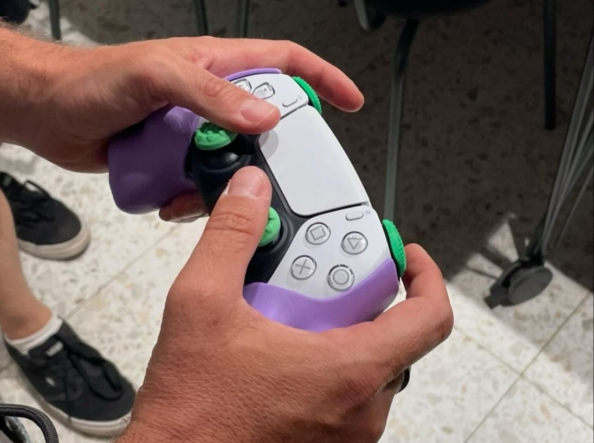

## Overview

Control de Ansiedad was developed as part of a project driven by M84.latam for Mindy — approaching emotional management during gaming from a design perspective. The challenge was open-ended from the start: the path wasn't fully defined, but the conviction was clear — use design to address a real problem in mental health and wellbeing.

The project proposes a joystick skin: a form-fitting accessory that integrates directly onto the controller, incorporating textures and pressure points inspired by reflexology. The goal is to help players recognize and regulate emotional states — anxiety, frustration, anger — in real time during play, without interrupting the experience.

## Design Process

The team formed with the advisory input of the Mindy team, M84.latam, and a reflexologist, whose expertise shaped the placement and intensity of the pressure zones on the skin. The design went through continuous iteration — testing form, material, texture density, and pressure geometry — until arriving at a solution that was both convincing conceptually and testable in real context.

The reflexology logic translated directly into the geometry: specific surface zones correspond to pressure points mapped to emotional regulation, making the tactile interaction functional rather than purely aesthetic.

## Fabrication

Multiple digital design and fabrication processes were developed in collaboration with FabLab UAI, whose support was key to materializing a proposal at this level. The fabrication workflow allowed rapid iteration between digital models and physical prototypes for in-context testing.

## Role & Tools

- High-precision 3D scanner — captured the joystick geometry as the base for the skin design
- Retopology — scan mesh cleaned and retopologized to produce a workable surface for design iteration
- Grasshopper — initial geometry exploration
- Blender — final geometry and surfacing; chosen over Grasshopper for the quality of its modifiers and UV mapping capabilities, which allowed more precise control over the texture distribution across the skin surface
- Digital fabrication — prototyping at FabLab UAI
- Reflexology-informed design — pressure zone mapping in collaboration with specialist
