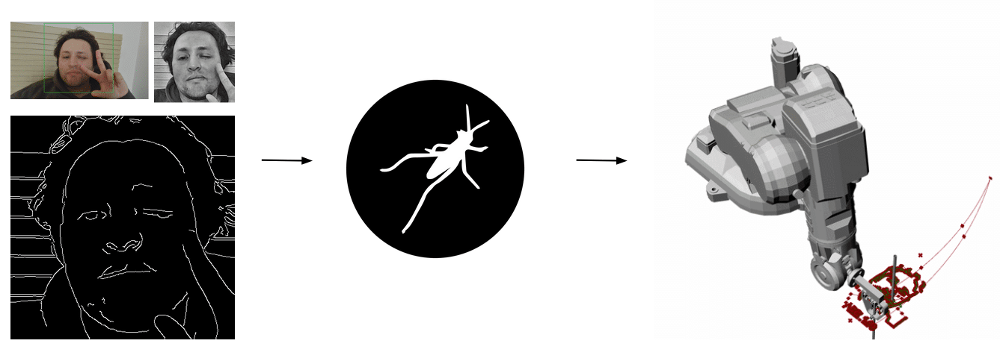
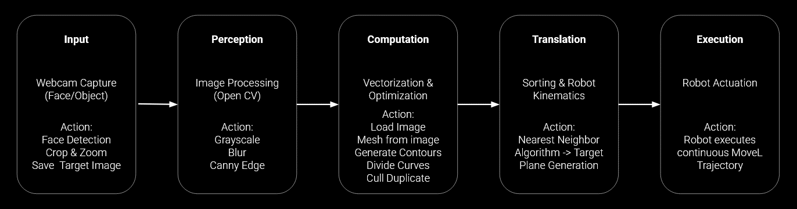
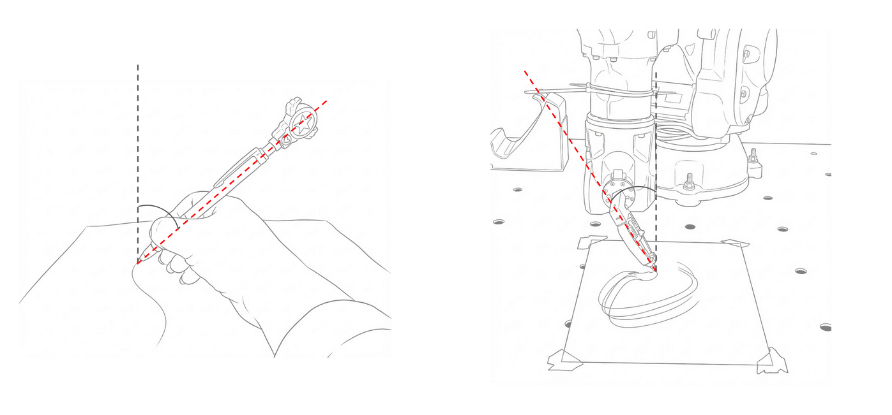
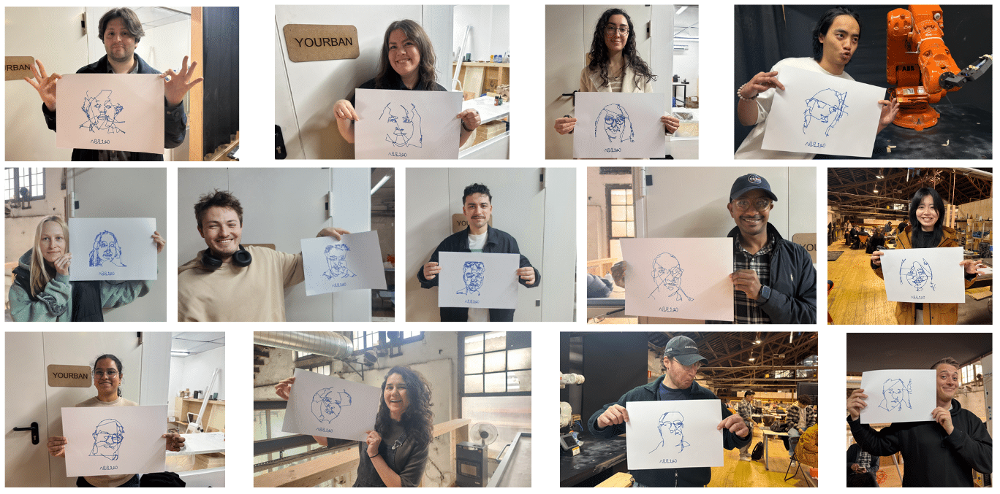

## Overview

Human Trace is a robotic sketching system that translates a person's face into a continuous, single-stroke physical drawing executed by an ABB robotic arm. Developed at IAAC's Master in AI for Architecture and the Built Environment, the project investigates how computational processes can produce fluid material expression under strict algorithmic constraints.

The core challenge: the drawing tool never leaves the surface. Unlike conventional plotters that freely reposition, the system must interpret image topology and calculate a path that maintains an uninterrupted line from start to finish — an approach closer to how a human draftsperson might sketch without lifting their pen.

## Pipeline

The system runs as a five-stage workflow connecting Python, Grasshopper, and the ABB robot:

**1. Input**
A webcam captures the subject. Python performs face detection, crops the image, and saves it for processing.

**2. Perception**
OpenCV processes the image through grayscale conversion, blur filtering, and Canny edge detection to extract a simplified contour map of the face.

**3. Computation**
The edge map is vectorized: contours generated, curves divided, duplicates removed, mesh prepared. This stage runs in Grasshopper, which receives the processed data from Python and builds the geometric stroke network.

**4. Translation**
Nearest-neighbor sorting orders the contour points to minimize jumps and preserve single-stroke continuity. Kinematic mapping converts the 2D path into target planes for the robot.

**5. Execution**
ABB RAPID code drives the arm through the full trajectory via MoveL commands — smooth, unbroken motion from first mark to last.

## Technical Details

- **End-effector angle:** 45°–60° to mimic natural drawing mechanics and prevent tool drag
- **Path optimization:** nearest-neighbor algorithm applied to contour point ordering
- **Vision:** Canny edge detection on grayscale + blur-filtered webcam crop
- **Communication:** Python ↔ Grasshopper data bridge for geometry processing

## Role & Tools

- Python + OpenCV — image capture, edge detection, contour processing
- Grasshopper — vectorization, path geometry, kinematic mapping
- ABB robotic arm (IAAC) — physical stroke execution via RAPID
