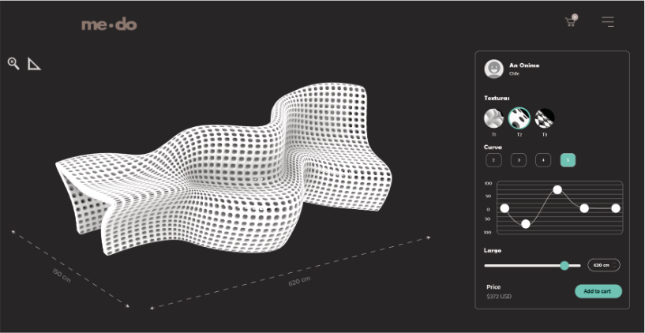
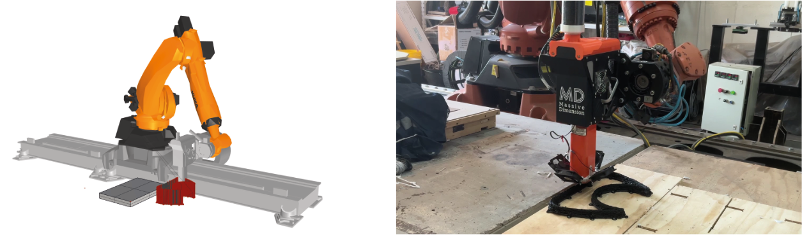
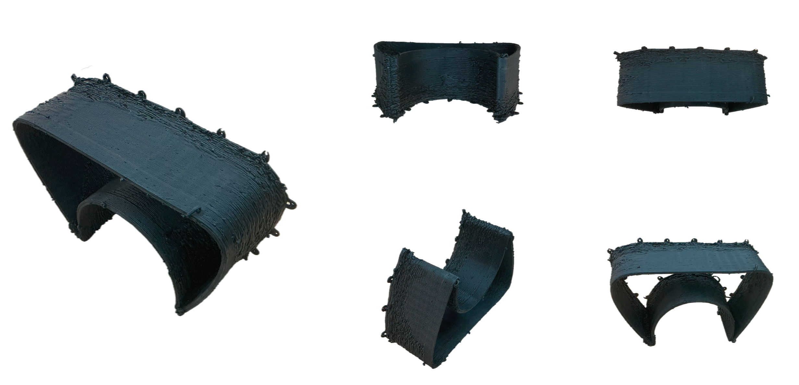
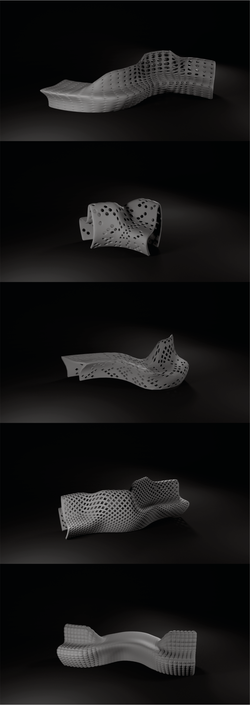

## Overview

Arauco — one of Chile's largest forestry and wood products companies — has an internal innovation department dedicated to exploring new applications for wood-derived materials, including furniture and architectural components made from wood cellulose.

**Medo 2.0** was a direct commission from this department to develop a parametric surface generation system for designing customizable benches. The core requirement was that the tool be accessible through a web interface, enabling non-specialist users to edit geometry parameters without opening Grasshopper or Rhino.

## Phase 1 — Parametric Web Tool (2020)

The system was built in Grasshopper and connected to **ShapeDiver**, a platform that hosts Grasshopper definitions and exposes them as interactive web applications. This allowed Arauco's team to:

- Adjust bench parameters (section profile, width, length, surface texture, structural density) directly in the browser
- Preview real-time 3D geometry updates without any CAD software
- Export fabrication-ready geometry from the web interface

The parametric logic handled continuity between surface curvature, structural logic, and manufacturing constraints simultaneously — ensuring every generated variation was buildable.

## Phase 2 — Robotic Fabrication (2024)

Four years later the project was revived with a new fabrication objective: producing large-scale physical prototypes. The KUKA robotic arm at **FabLab UAI** was used to 3D print bench sections in **TPU** (thermoplastic polyurethane) — a flexible, high-resilience filament well suited for furniture applications requiring both structural performance and material softness.

The workflow moved from Grasshopper geometry → toolpath generation → KUKA arm deposition, producing oversized sectional components that demonstrated the system's scalability from parametric model to physical object.

## Tools

- **Grasshopper / Rhinoceros** — parametric surface modeling and fabrication geometry
- **ShapeDiver** — web deployment of the Grasshopper definition as a browser-based design tool
- **KUKA robotic arm** (FabLab UAI) — large-format TPU extrusion
- Custom web interface for parameter control and 3D preview

