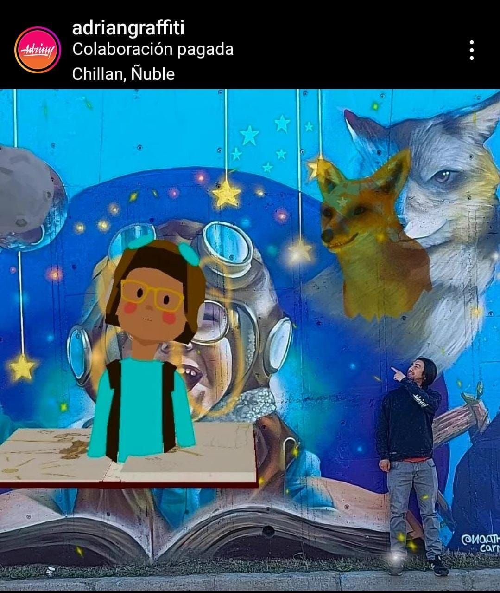
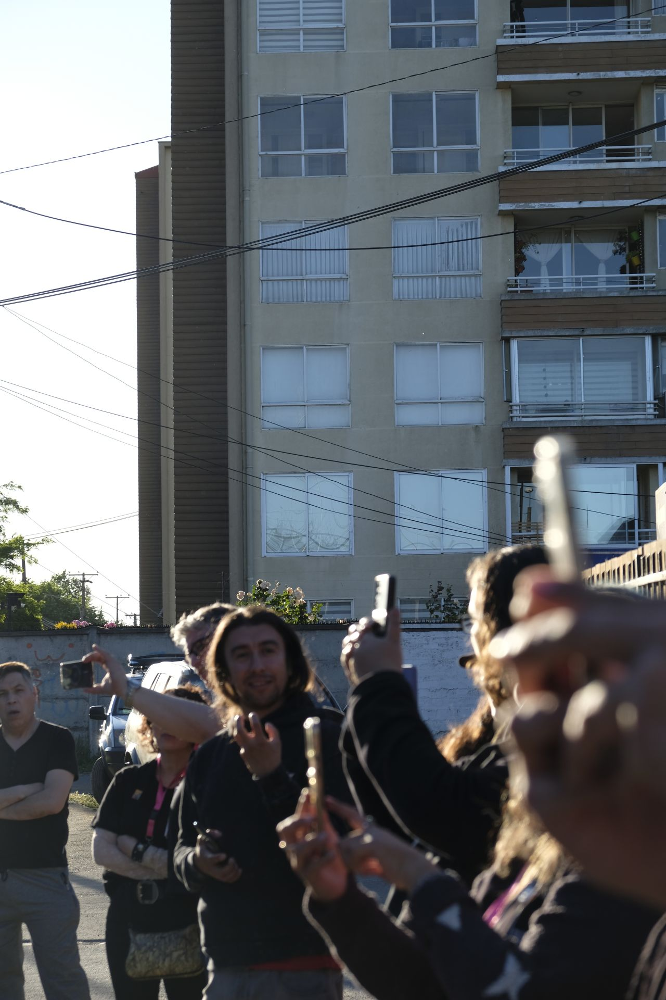

## Overview

An augmented reality experience developed for the Feria de las Culturas, Artes y Patrimonio (FICAP) Ñuble 2023 — held December 1–3 at Plaza Santo Domingo, Chillán, with over 150 artists participating.

The project centered on a street mural of *El Principito* (The Little Prince), painted by local urban artist Adrián Quiroz to commemorate the 80th anniversary of Antoine de Saint-Exupéry's publication. The AR filter — developed in Meta Spark — allowed anyone to point their phone at the mural and see it come to life in 3D, overlaying the physical wall with digital animation and incorporating invisible narrative lines from the story (the fox, the mentor's presence) that only appear through the lens.

The filter was published on Instagram and Facebook through the Culturas Ñuble account, making the experience publicly accessible to anyone visiting or passing by the mural at its permanent location on Calle Alcalde Iván Ulriksen con pasaje Hernán Saint-Exupéry.

## Context

The initiative was driven by the Secretaría de Economía Creativa de Ñuble and CRT+IC (Centro para la Revolución Tecnológica en Industrias Creativas), as part of a broader effort to bring AR technology into public cultural spaces in the region. Described by CRT+IC director Isidora Cabezón as "tremendamente innovador" for the region — the first AR mural of its kind in Ñuble.

## Role & Tools

- Meta Spark — AR filter development and 3D mural activation
- Instructor at CRT+IC — responsible for the AR layer of the project
- Collaboration with urban artists (Pintarte agrupación) and the Secretaría de Economía Creativa de Ñuble
