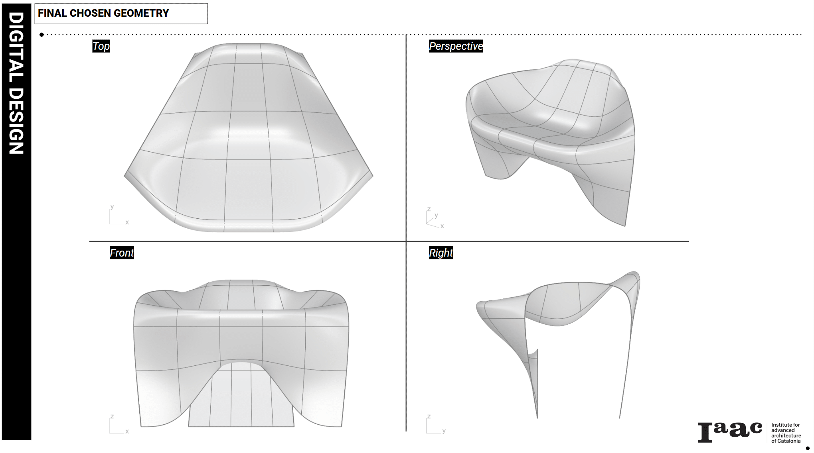
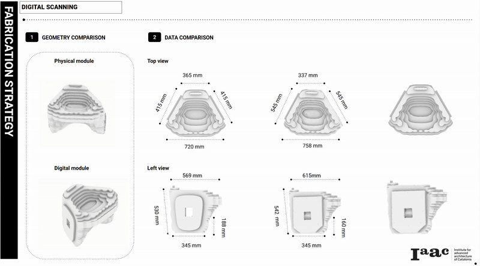
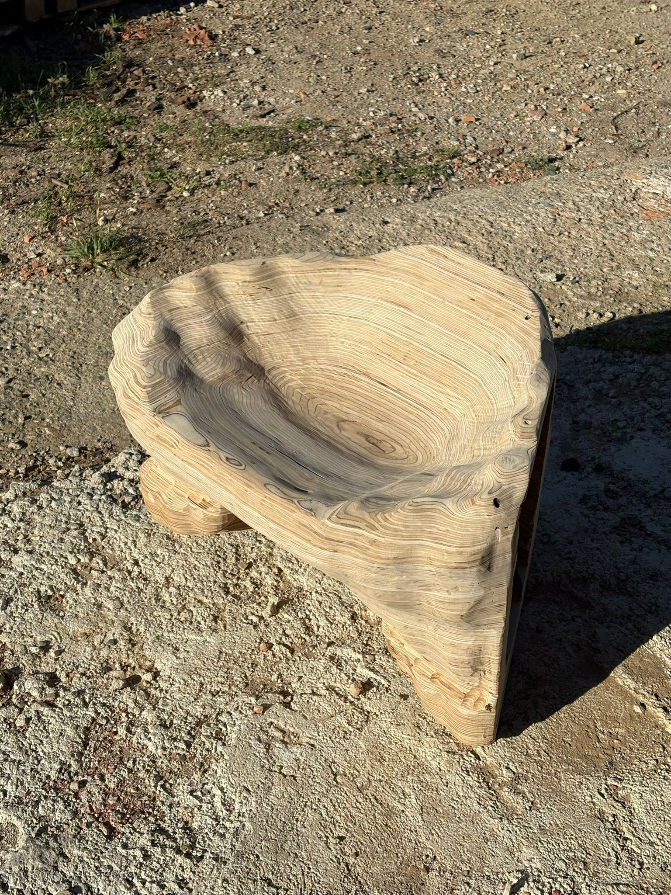

## Overview

Nidra Chair was developed during MRAC & MAEB Workshop 1.1 at IAAC's Valdaura laboratory. The project explores robotic milling as a fabrication strategy for organic, complex geometry — producing a full-scale chair from laminated wood using a KUKA robotic arm.

The form references protective, enclosing shapes: a hybrid between a shell, an egg, and a dragon's nest. Conceptually guided by ideas of texture, nest, wings, and storage.

## Digital Model

The chair geometry was built using SubD (subdivision surface) modeling to generate a smooth, open-surface form. Dragon-scale surface texture was generated in Grasshopper via the Weavebird plugin, with extrusion heights driven by surface point parameters to create organic variation across the geometry.

The digital model used for fabrication was based on a photogrammetry scan of the physical blank, scaled to match — allowing the milling toolpaths to account for real-world dimensional inconsistencies between the digital design and the assembled laminated stock.

## Fabrication

Material: laminated wooden sheets, 24mm boards.

Milling strategy: patch-based toolpaths — the geometry was divided into eight sections, each milled independently. This approach allowed the KUKA arm to reach all areas of the complex surface without requiring full repositioning of the workpiece, and kept toolpath lengths manageable for the robotic workflow.

A 20mm material margin was maintained for roughing passes before finishing cuts. The surface was hand-sanded after milling to achieve a smooth finish.

## Role & Tools

- Grasshopper + Weavebird — parametric surface texture design
- SubD modeling — base chair geometry
- KUKA robotic arm (Valdaura lab) — CNC milling
- Photogrammetry — dimensional scan for digital model correction
