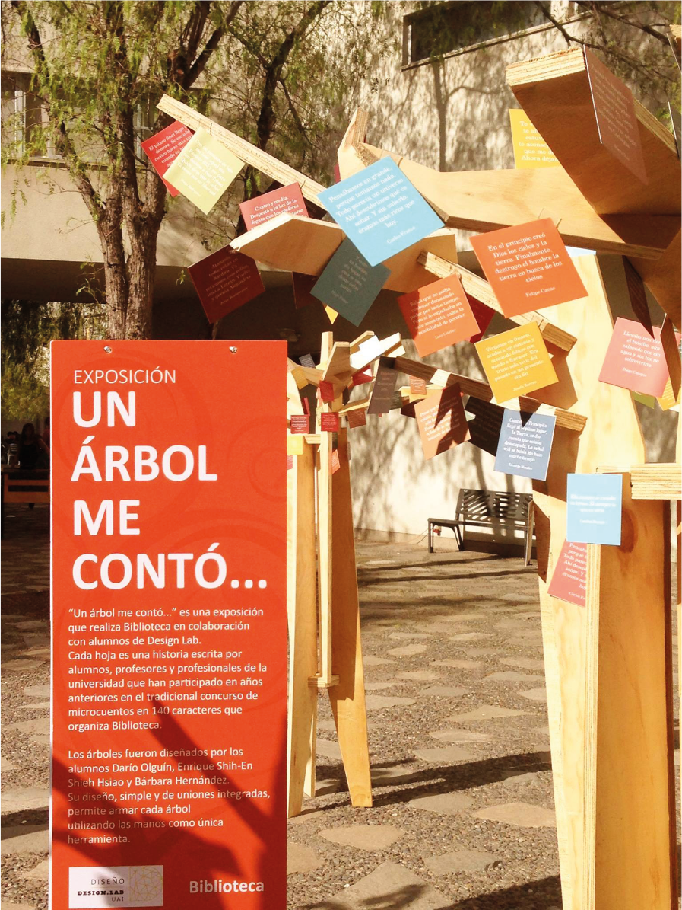
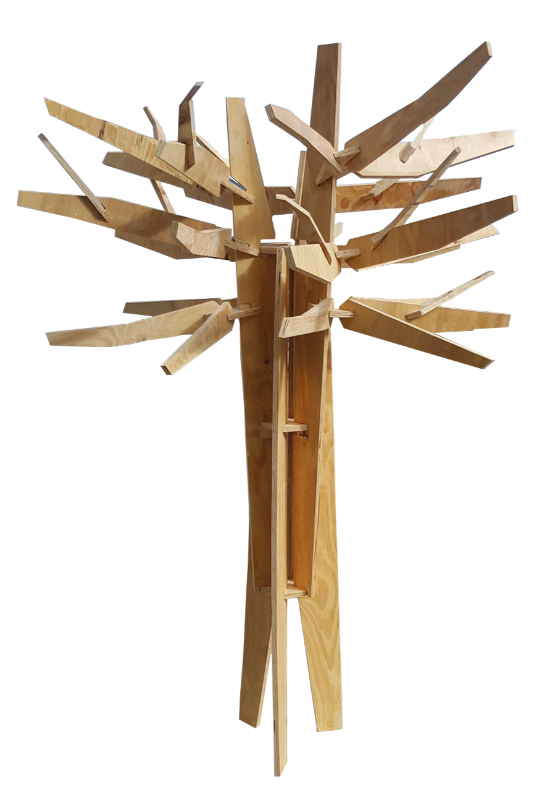
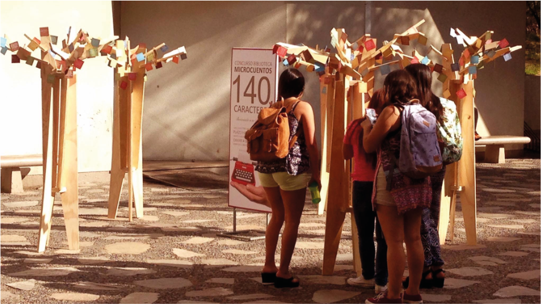

## Overview

A competition brief from the Adolfo Ibáñez University library with a strict material constraint: using no more than **one and a half sheets of 1200 × 2400 mm plywood**, design and fabricate a structure capable of displaying short stories during Chile's national Literature Week.

The response was a tree — constructed entirely through interlocking (press-fit) joinery with no fasteners or adhesives. The design was engineered so that every piece nested within the material budget, and the branching structure could be assembled and disassembled without tools.

## Design Logic

The tree's structural system relied on **encaje** (interlocking notch joints) cut directly into the plywood — a technique that turns sheet material into a rigid three-dimensional form through the precision of the cuts alone. The branching geometry was designed so that the outstretched limbs became natural display points: each branch could hold one or several printed short stories, creating a spatial reading experience that visitors navigated by moving around the piece.

The material constraint drove the formal decisions — branch thickness, trunk proportion, and overall scale were all determined by what could be efficiently nested and cut from the available plywood area with minimal waste.

## Exhibition & Donation

The tree was exhibited at two UAI campuses:

- **Campus Peñalolén**, Santiago
- **Campus Viña del Mar**

Following the university exhibitions, the piece was **donated to the Municipalidad de Peñalolén**, where it was exhibited again as a public installation — extending the project beyond the academic context into the community it was originally named for.
