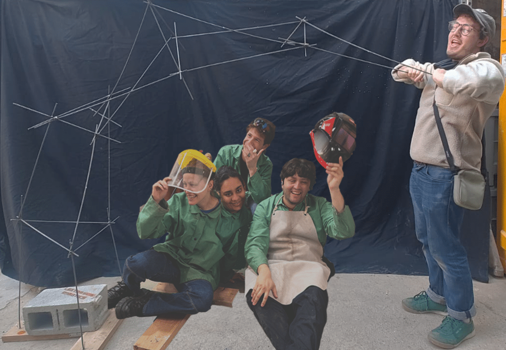
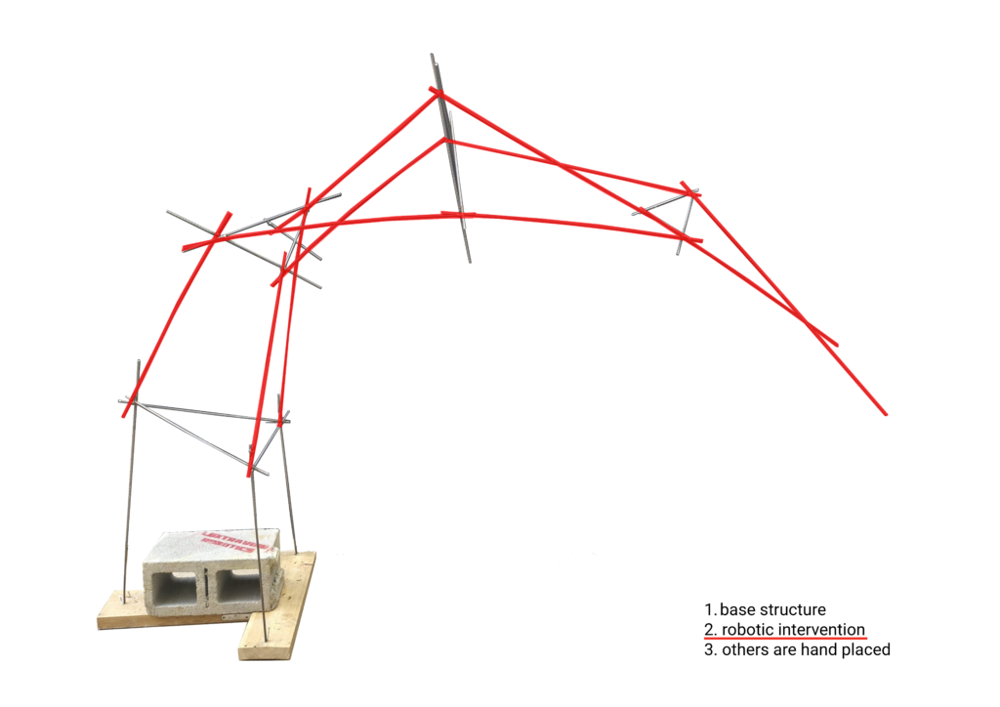
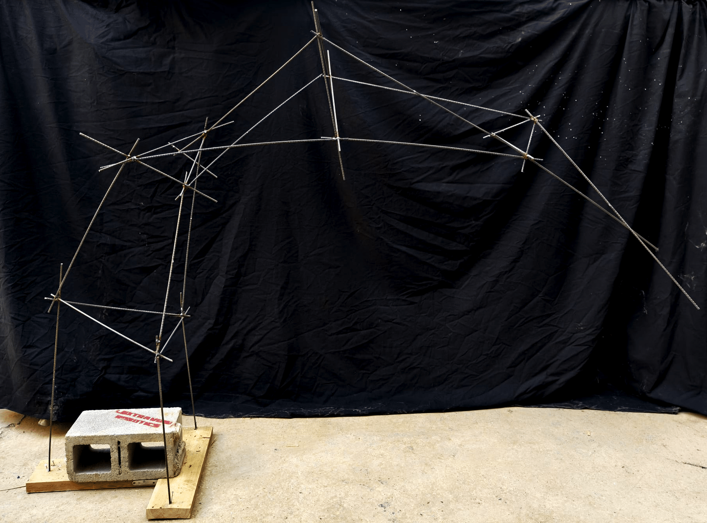
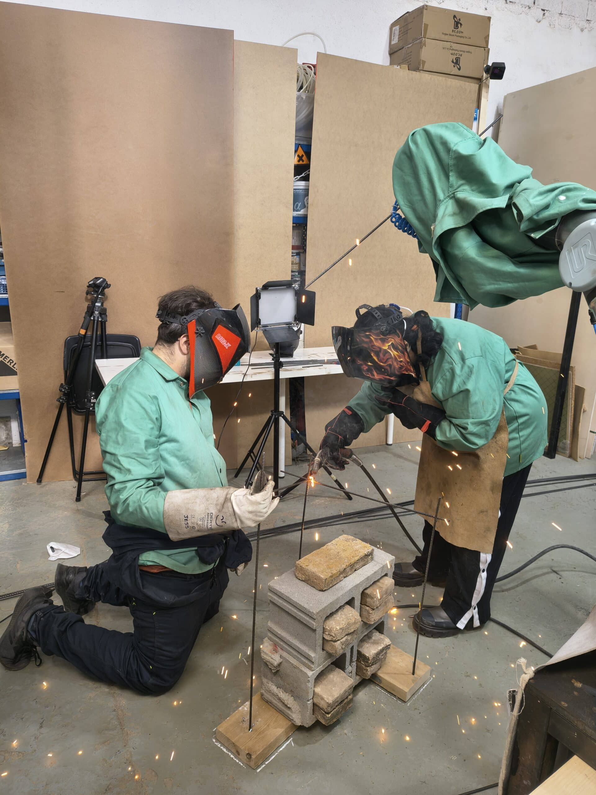
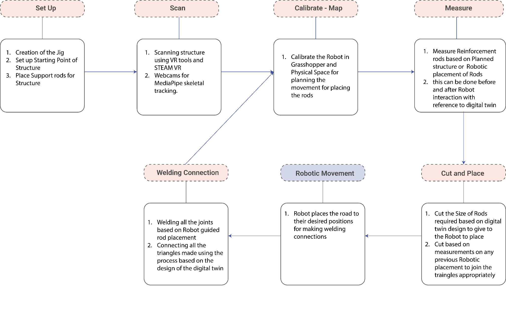
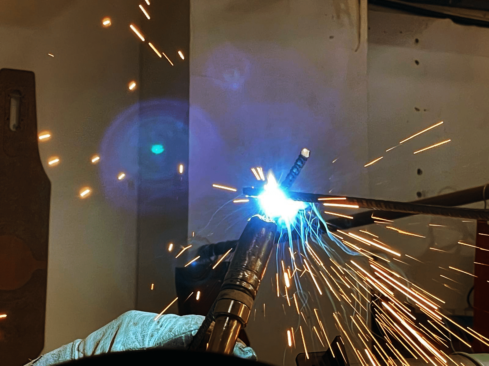

<video src="workshop-3-1-robot-human-collaboration-in-metal-fabrication/workshop-video.mp4" autoplay muted loop playsinline style="width:100%;border-radius:4px;margin-bottom:1.5rem;"></video>

<iframe width="100%" style="aspect-ratio:16/9;border-radius:4px;margin-bottom:1.5rem;" src="https://www.youtube.com/embed/dC6U_4RJGqM" title="Workshop 3-1: Robot-Human Collaboration in Metal Fabrication" frameborder="0" allow="accelerometer; autoplay; clipboard-write; encrypted-media; gyroscope; picture-in-picture; web-share" allowfullscreen></iframe>

## Overview

A workshop within MRAC at IAAC investigating how robotic precision and human craft can combine in a single fabrication process. Rather than pursuing full automation, the project built a workflow where a UR10e robotic arm and skilled human welders worked collaboratively — the robot positions each 6mm steel rod to a digitally computed geometry, and students weld the joints by hand.

The result is a welded steel rod structure whose geometry was designed in Grasshopper, calibrated to the physical space via SteamVR controller tracking, and assembled through a continuous back-and-forth between machine and person. WebSocket communication connected the spatial tracking system to Grasshopper in real-time, feeding controller positions directly into the digital twin of the fabrication process — each spatial point the controllers mapped updated the live model instantly.

## Process

The workflow created a recursive feedback loop between the physical and digital states of the structure:

1. Digital geometry generation in Grasshopper
2. Calibration using HTC Vive spatial markers
3. Robotic rod positioning with the UR10e
4. Manual welding and adjustment at each joint
5. Physical measurement and scanning of the result
6. Digital model recalibration based on the as-built state

## Fabrication

Two students weld simultaneously at the robot-positioned joints — one steadying the rod, the other running the electrode. Humans excel at intuitive material assessment and real-time adaptation; the robot provides precision and consistent positioning across the full sequence.

## Structure

The diagram shows the three-layer logic of the assembly: the base structure anchored to a concrete block, the robotic intervention (highlighted in red), and the hand-placed connecting rods that triangulate the form.

## Role & Tools

- UR10e robotic arm — precision rod placement from Grasshopper-computed paths
- Grasshopper — digital twin, calibration, and robotic path generation
- SteamVR + HTC Vive controllers — spatial tracking, position mapping, live calibration
- WebSocket — real-time communication between tracking system and Grasshopper
- MIG welding — manual joint connection at robot-positioned nodes
- 6mm steel rod — primary structural material

**Faculty:** Nacho Monereo, Prottay Roy Chowdhury — **Guest Artist:** Maria Mallo

## Port to Meta Quest 3

The SteamVR-based spatial tracking workflow developed here was later ported to Meta Quest 3, eliminating the need for SteamVR base stations entirely. The same WebSocket communication architecture connects Quest 3's onboard tracking to Grasshopper, running the identical digital twin workflow on standalone hardware without external infrared tracking infrastructure.
